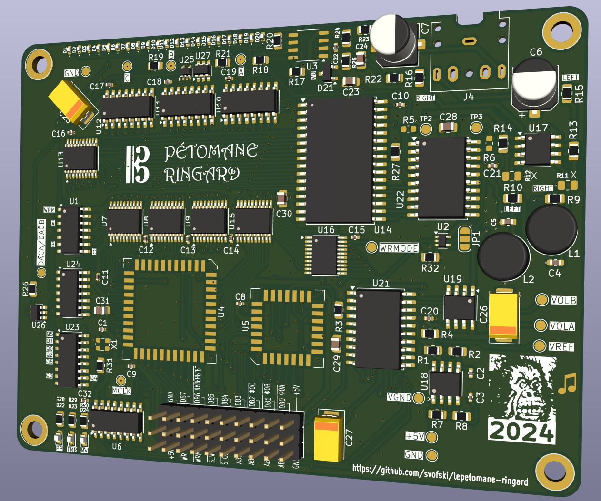

# Pétomane ringard

A "simple" 3-voice "sound chip" with wavetables.

## Current status: 
 - [x] waiting for the first revision of PCB
 - [x] research implementation of USB MIDI
   - [ ] pico firmware in [sw/pico](sw/pico)
 - [x] audio level meter based on CH32V003
    - [CH32V003 specific notes](CH32V003-notes.md)
    - The code for the level meter is [here](wch-ch32v003/pio-arduino-ch32v003)
 - [ ] assemble the PCB
   - [x] audio level meter
   - [x] Pi Pico host board
   - [ ] main board

## About this project

A never ending search of a simple chiptune synthesizer design that could have existed back in the 1980s. This design departs from the tech available to hobbyists in the 80s, but it's not too out there either. 

### Description in broad strokes

The master clock is 8MHz. Potentially 10MHz, but it would be pushing the capabilities of 82C54. The timer divides the main frequency and provides the pitch for the 3 channels. 

Waveforms are stored as samples in a ROM. This is essentially a short sample player. A sample is always 256 counts long, 8-bit waveform. For example, a sawtooth would be a sequence of numbers 0..255 stored in addresses 0..255. 
The ROM has 16 address bits, so there are 256 waveforms. This is how timbre and volume are set: simply by selecting 8 MSB of the sample address. It is possible to define just one waveshape and 256 amplitude levels, or for example 4 waveshapes and 64 amplitude levels for each one. Or several MSB bits could be reserved for selecting drum samples. It's a relatively flexible system.

One important remark. Because this is a frequency divider and the base frequency is only 8MHz, we don't get a good resolution if samples represent a single period. For decent musical resolution the waveforms will have to be squeezed to maybe 32 or 64 samples per period.

The 3 channels are time-multiplexed and sent to the two channels of DAC (TLC7258C) in a sequence. In order to provide a stereo mix, channels A/B/C/A/B/C are steered to channels L/L/R/L/R/R. Hopefully this will create an effect of a stereo mix where Left = A + 0.5B and Right = 0.5 + C.

There is a master volume which is just a second DAC providing reference voltage for the main DAC. If the main DAC is stopped, the master volume can be used to play back samples directly.

Channel B (central) can optionally stop after playing a sample once. This may be useful to play back short drum samples.

The MSB for channels A/B/C is set respectively in the registers A/B/C of 82C55. 

Because ROMs are a rare beast in 2024, K6X4008C1F SRAM is used instead. Only 64K of available address space is used. Loading is facilitated by the same 82C55 chip.

The external interface in the Pétomanesque tradition looks like a parallel port "ПУ" of Vector-06C, but in reality it's just a cursed three-row 2.54mm pin header. It is yet to be discovered whether this could ever be useful in a real computer or not. For now Raspberry Pi Pico will be used as a main driver for this board.

The complexity of this design surpasses the original expecation, yet remains within realm of possibility for a 80s design. SRAM in such quantities would have been wildly expensive back in the day, so a ROM could be used instead.

## Schematic/BOM
 * [https://github.com/svofski/lepetomane-ringard/tree/master/kicad/neopeto](https://kicanvas.org/?github=https%3A%2F%2Fgithub.com%2Fsvofski%2Flepetomane-ringard%2Ftree%2Fmaster%2Fkicad%2Fneopeto)
 * [ibom](https://svofski.github.io/lepetomane-ringard/ibom.html)
